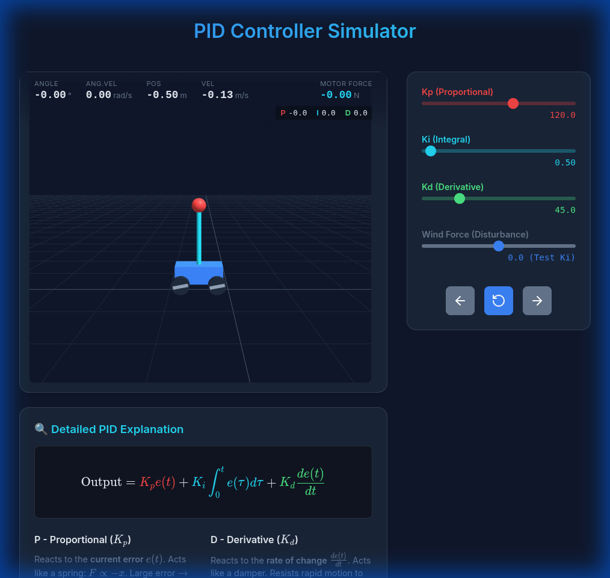

# 🤖 PID Self-Balancing Robot: A Calculus-Based Approach



1.  **Stability**: The robot balances perfectly with tuned values ($K_p=120, K_i=0.5, K_d=45$).
2.  **Disturbance Rejection**: When pushed, it recovers quickly.
3.  **Low Damping ($K_d=5$)**: Reducing $K_d$ triggers oscillations (instability).
4.  **Wind Resistance ($K_i$)**: With strong wind, the robot initially leans. Increasing $K_i$ removes this steady-state error, bringing it back to vertical.


An open-source project designed to explain and implement a PID (Proportional-Integral-Derivative) controller for a two-wheeled balancing robot. This repository bridges the gap between high-level Calculus theory and real-world embedded programming.

## 📖 1. The Core Concept: Calculus for Humans

In robotics, Calculus is the language of movement. We use it to observe how "errors" change over time.

| Concept | Mathematical Meaning | Intuitive Action |
| :--- | :--- | :--- |
| **Derivative** ($d/dt$) | Rate of change at a specific moment. | **Slicing**: Measuring speed to predict the future. |
| **Integral** ($\int dt$) | Accumulation of values over time. | **Gluing**: Adding up past errors to ensure precision. |

## ⚙️ 2. How PID Works (The "Brain")

To keep a robot upright, we calculate the **Error** ($e$) (the difference between the current tilt angle and $0^\circ$).

### P - Proportional (The Present)
*   **Logic**: The more the robot tilts, the harder the motors push back.
*   **Formula**: $K_p \cdot e(t)$

### I - Integral (The Past)
*   **Logic**: It remembers past errors. If the robot leans for a long time due to friction or weight imbalance, the Integral "adds up" these tiny errors until they generate enough force to push the robot back to exactly $0^\circ$.
*   **Formula**: $K_i \cdot \int_{0}^{t} e(\tau) \, d\tau$

### D - Derivative (The Future)
*   **Logic**: It measures the velocity of the fall. If the robot is falling fast, the D-term applies a "brake" to dampen the movement and prevent overshooting.
*   **Formula**: $K_d \cdot \frac{de}{dt}$

## 💻 3. Implementation: Theory vs. Code

In computer science, we cannot calculate "infinitely small" changes. Instead, we use **Discretization**.

*   **Derivatives become Subtraction**: $\frac{\Delta e}{\Delta t} = \frac{error_{now} - error_{last}}{time_{interval}}$
*   **Integrals become Addition**: $\sum (error \times \Delta t)$

### Pseudo-Code Implementation

```python
# Constants (Tuning knobs)
Kp = 15.0  # Aggressiveness
Ki = 0.8   # Precision
Kd = 1.2   # Stability

total_error = 0
last_error = 0
dt = 0.01  # 10ms sampling rate

while True:
    current_angle = read_gyroscope()
    error = current_angle - 0  # 0 is the target (upright)
    
    # 1. Proportional
    P = Kp * error
    
    # 2. Integral (Summation)
    total_error += error * dt
    I = Ki * total_error
    
    # 3. Derivative (Difference)
    D = Kd * (error - last_error) / dt
    
    # Output to Motors
    motor_speed = P + I + D
    apply_power(motor_speed)
    
    last_error = error
    wait(dt)
```

## 🛠️ 4. Practical Tuning Tips

1.  Set $K_i$ and $K_d$ to zero. Increase $K_p$ until the robot starts oscillating (shaking back and forth).
2.  Increase $K_d$ to dampen the oscillations and make the robot move smoothly.
3.  Increase $K_i$ only if the robot settles at a slight angle instead of perfect vertical.

## 📝 License

This project is licensed under the MIT License - feel free to use, modify, and share!